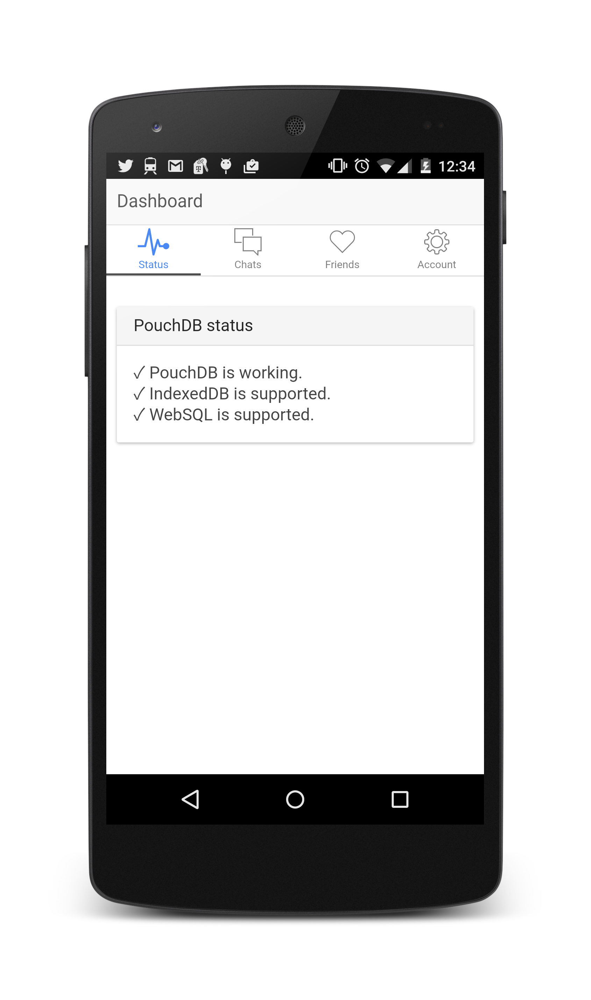
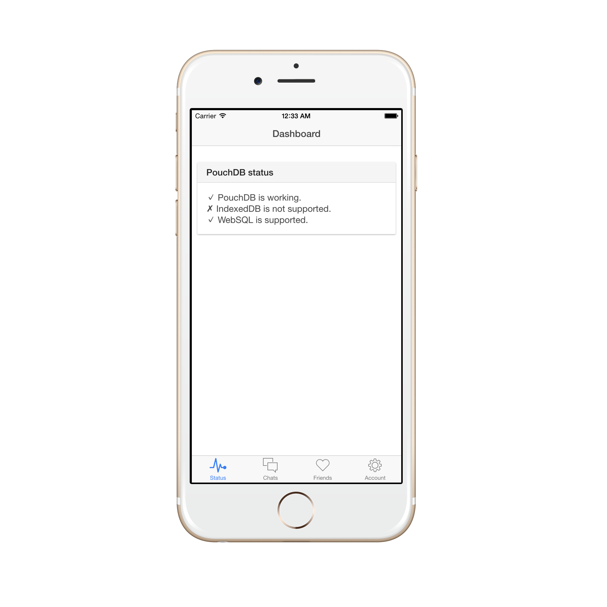
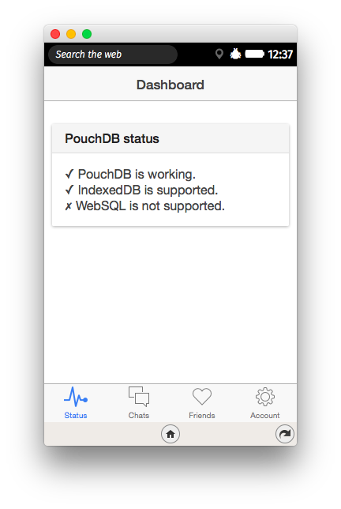

PouchDB Ionic "hello world" app
======

This is a basic Ionic app. It was created using the `ionic` CLI, by running:

    ionic start pouchdb-ionic-hello-world

Then to install PouchDB, I ran:

    bower install --save pouchdb
    
(So you may need to run `bower install` in order to download the `pouchdb.js` file.)

Then I added `pouchdb.js` to `index.html`:

```html
<script src="lib/pouchdb/dist/pouchdb.min.js"></script>
```

To run the app yourself on a variety of platforms, just check out the code and follow the instructions below.

### Android

    cordova platform add android
    ionic run android
    
What you'll see:

<a href="./screenshots/android.png"></a>

### iOS

    cordova platform add ios
    ionic run ios

What you'll see:

<a href="./screenshots/ios.png"></a>

### FirefoxOS

    cordova platform add firefoxos
    ionic build firefoxos

(Then install manually using `about:app-manager` in Firefox.)

What you'll see:

<a href="./screenshots/firefoxos.png"></a>

### Other platforms

Feel free to try it out and take screenshots. :)